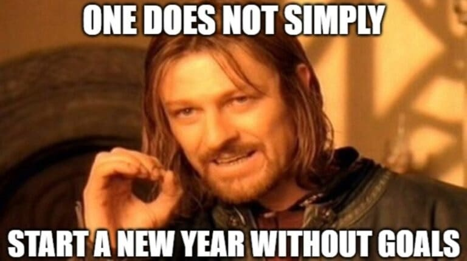

I plan to start a series [year-in-review][year-review-wiki] where I plan to look back on what happened.

**Do not think I came up with my yearly goals in late September. I had this done in January on vacation and wrote all of it down in a note on my phone.**

# Goals

- **Professional goals:** Advance my career. Not sure yet, how this turns out, thus this is quite vague for now. At least discuss a raise. Maybe change roles. Probably stay in the same industry though. I want to write more technical stuff/posts (a good way to review what I learned). Next: Focus more on Data Engineering/Science. Finish professional trainings in this direction.
- **Health & sports goals:** I want to lift more. I was a lot stronger once (10 years ago 😆) and I want get back to glory. I plan to start [5x5 stronglifts programm][stronglifts]. This is very focused on legs, a muscle I want to focus on as well. I want to squat 1.5x my own bodyweight (as of now this would be ~115kg). On the side of my general physical health I want to improve my lung function.
- **Personal growths goals:** Read (and finish) 3 books this year. Improve my chess rating to 1300 in rapid time format. Lastly increase personal wealth (+X amount).
- **Vacation:** Go on at least one camping vacation in another country I did not visit yet.
- **Learn something new:** I want to be a good baker (bread!). 

I keep a list of those goals (it is a spreadsheet) to track. The first three **Professional Goals, Health & sports goals and Personal growths goals** are the three main categories I fill in every start of the year. I am a big believer of defining [goals following the SMART framework][smart-goals].

As I am fan of journaling I use my journal to keep track of smaller steps reaching those goals. You could say this cascades down. The idea is trying to improve just a little by little (say 1%) per day - and keep track of it. Essentially the philosophy proposed by in the excellent book Atomic Habits by [James Clear][james-clear].

[year-review-wiki]: https://en.wikipedia.org/wiki/Year-in-review
[smart-goals]: https://en.wikipedia.org/wiki/SMART_criteria
[stronglifts]: https://stronglifts.com/stronglifts-5x5/workout-program/
[james-clear]: https://jamesclear.com/
